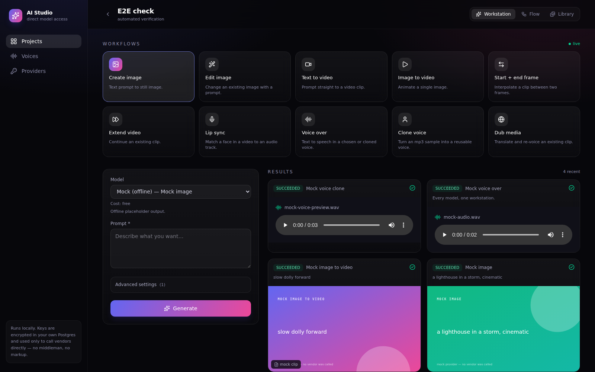
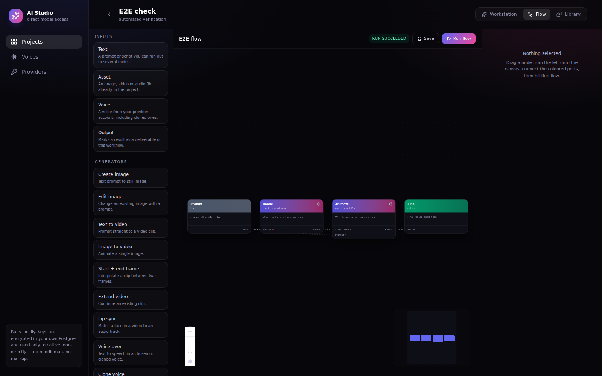

# AI Studio

A local, self-hosted studio for generative media — images, video, voice over, voice
cloning and dubbing — with a prompt workstation, a drag-and-drop node canvas, a project
library and Postgres persistence.

Models are called **directly**, with your own API keys. No aggregator sits in the middle
taking a cut, so you pay each vendor's list price.



## What it does

| Workflow | What you give it | What you get |
| --- | --- | --- |
| Create image | prompt | still image |
| Edit image | image + instruction | edited image |
| Text to video | prompt | clip |
| Image to video | start frame + prompt | clip |
| **Start + end frame** | two frames + prompt | clip interpolating between them |
| Extend video | clip + prompt | longer clip |
| Lip sync | clip + audio | clip with matched mouth |
| Voice over | script + voice | mp3 |
| **Clone voice** | one mp3 sample | a reusable voice for every voice over |
| Dub media | clip + target language | re-voiced clip |

Each one is a *capability*. Several vendors can serve the same capability, so you pick the
model per generation from one dropdown.

Wire those same workflows together on the canvas:



## Quick start

```bash
cp .env.example .env          # then set APP_SECRET to something random
docker compose up -d          # Postgres + Redis
npm install
npx prisma migrate deploy     # create the schema
npm run db:seed               # optional: a sample project and flow

npm run dev                   # the app      → http://localhost:3000
npm run worker                # the worker   (second terminal — required)
```

The worker is not optional: generations take minutes, so every job runs there, never
inside a request.

**No API keys?** Every capability is also implemented by a built-in `mock` provider that
returns placeholder media offline. The queue, the canvas and the library are fully
usable — and cost nothing — before you add a single key.

## Adding your keys

Open **Providers** in the sidebar and paste a key, or set the matching variable in `.env`.
Keys pasted in the UI are encrypted with AES-256-GCM (keyed off `APP_SECRET`) before they
reach the database, and the UI only ever shows a masked version.

| Provider | Serves | Key |
| --- | --- | --- |
| MiniMax (Hailuo) | text→video, image→video, start+end frame | `MINIMAX_API_KEY` + `MINIMAX_GROUP_ID` |
| Runway | image→video, start+end frame | `RUNWAY_API_KEY` |
| Google (Veo / Imagen) | text→video, image→video, images | `GOOGLE_API_KEY` |
| Kling | video, images, lip sync | `KLING_API_KEY` as `accessKey:secretKey` |
| OpenAI | images, image editing | `OPENAI_API_KEY` |
| Black Forest Labs (FLUX) | images, instruction editing | `BFL_API_KEY` |
| ElevenLabs | voice over, voice cloning, dubbing | `ELEVENLABS_API_KEY` |

> Vendors change their APIs often. Every call to a vendor lives in exactly one file under
> `src/lib/providers/`, with the endpoint and payload in plain sight — if a vendor moves a
> field, that file is the only thing to edit. Adapters are written against each vendor's
> published REST API; check the docs link in `Providers` if a call starts failing.

## How it fits together

```
 browser ──> Next.js routes (/api/*) ──> Postgres        (projects, jobs, assets, flows)
                    │                     Redis          (BullMQ queue)
                    │
                    └── enqueue ──> worker ──> provider adapter ──> vendor API
                                        │
                                        └── download result ──> storage ──> Asset row
                                                                    │
 browser <── SSE /api/events <───────────────────────────────────────┘
```

- **Capability layer.** The UI asks for `video.startEndFrame`; the registry lists every
  model that serves it. No vendor is load-bearing — delete an adapter and the rest keeps
  working.
- **Job pipeline.** `submit → poll → download → store` (`src/lib/jobs/runner.ts`). Media
  inputs are resolved from asset ids to bytes, so a generated image can feed the next call.
- **Flow engine.** A saved graph runs in topological order; each generation node creates a
  real job and its output flows down the edges (`src/lib/engine/graph.ts`).
- **Storage.** Local disk by default (`./data/media`), S3/MinIO by flipping
  `STORAGE_DRIVER=s3` — the same code path, ready for a cloud VM.

## Project layout

```
prisma/schema.prisma        Project, Asset, Job, Workflow, WorkflowRun, Credential, Voice
src/app/                    pages + /api routes
src/components/             shell, workstation, library, settings
src/components/flow/        the node canvas
src/lib/providers/          one file per vendor + the registry
src/lib/engine/             node/port model and the graph runner
src/lib/jobs/runner.ts      the generation pipeline
worker/index.ts             BullMQ worker
```

## Adding a provider

1. Write `src/lib/providers/<vendor>.ts` exporting a `ProviderAdapter`: declare its
   `models` (each with a `capability` and its parameter fields), then implement `submit`
   and, if the vendor is async, `poll`.
2. Add it to the `PROVIDERS` array in `src/lib/providers/registry.ts`.

That is the whole integration. The workstation form, the model dropdown, the node
palette, the queue and the settings screen all build themselves from the registry.

## Deploying later

Nothing here is tied to your laptop: the app and worker are two Node processes,
Postgres and Redis are in Compose, and media moves to S3 with one env var. Put it behind
auth before exposing it — there is no login yet, by design, because it is a single-user
local tool today.
